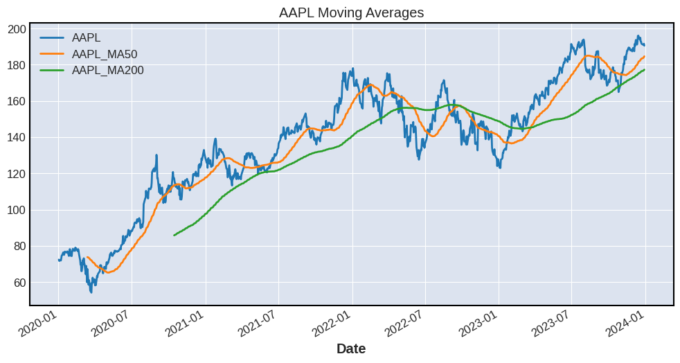
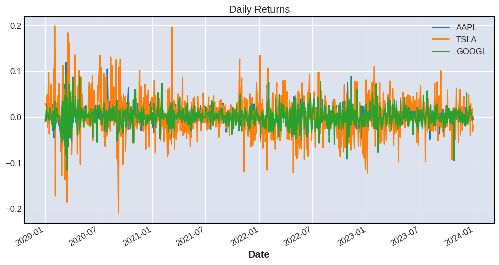
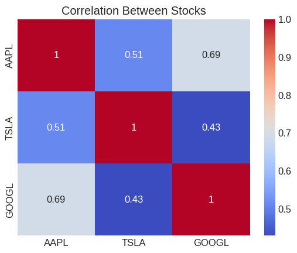
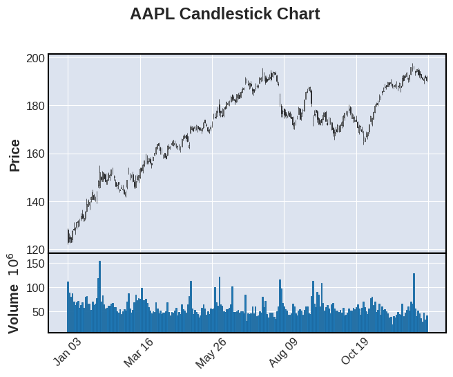

# 📈 Stock Market Analysis & Prediction

---

## 🎯 Problem Statement

Stock market data is highly dynamic and complex, making it difficult for investors to identify meaningful patterns and trends.
This project aims to analyze historical stock data to uncover insights related to **trend, volatility, correlation, and risk**, using data analysis and visualization techniques.

---

## 📊 Dataset

* Source: Yahoo Finance API (`yfinance`)
* Stocks Analyzed: AAPL, TSLA, GOOGL
* Time Period: 2020 – 2024

---

## 🛠 Tools & Technologies

* Python
* Pandas, NumPy
* Matplotlib, Seaborn
* mplfinance (Candlestick charts)
* Scikit-learn

---

## 📈 Data Analysis Workflow

### 1️⃣ Data Collection & Cleaning

* Extracted stock data using API
* Handled missing values
* Prepared dataset for analysis

---

### 2️⃣ Exploratory Data Analysis

* Analyzed price trends
* Studied stock behavior over time
* Compared multiple stocks

---

## 📊 Visualizations & Analysis

### 📈 Moving Average Analysis



This chart shows the **50-day and 200-day moving averages**, which help identify long-term trends.
The upward movement indicates consistent growth, while crossovers suggest potential trading signals.

---

### 📉 Daily Returns Analysis



Daily returns help measure **volatility and risk**.
Higher fluctuations indicate more uncertainty in stock performance.

---

### 📊 Correlation Heatmap



The heatmap shows relationships between stocks.
Strong positive correlation suggests that tech stocks often move together, reducing diversification benefits.

---

### 📉 Candlestick Chart



Candlestick charts provide detailed insight into **price movements within a time period**, including opening, closing, high, and low prices.

---

## 📊 Key Insights

* TSLA exhibits **high volatility**, making it suitable for high-risk, high-reward strategies
* AAPL shows **stable and consistent growth**, ideal for long-term investment
* GOOGL demonstrates moderate growth with balanced risk
* Strong correlation among tech stocks suggests limited diversification
* Moving averages confirm a **long-term upward trend** in the market

---

## 🔥 Key Finding

Among the analyzed stocks, **TSLA stands out as the most volatile**, offering higher potential returns but also greater risk, whereas **AAPL remains a stable choice for long-term investors**.

---

## 🤖 Machine Learning Model

* Implemented **Linear Regression** for stock price prediction
* Used historical closing prices as input
* Generated predictions to estimate future price trends

---

## 📈 Features of the Project

* Multi-stock comparison
* Trend analysis using moving averages
* Volatility analysis using returns
* Correlation analysis
* Candlestick visualization
* Basic predictive modeling

---

## 🚀 Future Improvements

* Advanced prediction models (LSTM, ARIMA)
* Real-time stock dashboard using Streamlit
* Interactive dashboard using Power BI

---

## 📂 Project Structure

```
stock-market-analysis/
│
├── notebooks/
│   ├── 01_data_analysis.ipynb
│   ├── 02_visualization.ipynb
│   └── 03_ml_prediction.ipynb
│
├── images/
│   ├── moving_avg.png
│   ├── returns.png
│   ├── heatmap.png
│   └── candlestick.png
│
├── README.md
└── requirements.txt
```

---

## ⚙️ Installation

```bash
pip install -r requirements.txt
```

---

## 👨‍💻 Author

**Darahas Reddy**
GitHub: https://github.com/Darahas-reddy

---

## ⭐ Conclusion

This project demonstrates the ability to **analyze real-world financial data**, extract insights, and build predictive models using data analysis techniques.
It highlights key skills required for a **Data Analyst role**, including data cleaning, visualization, and interpretation.
